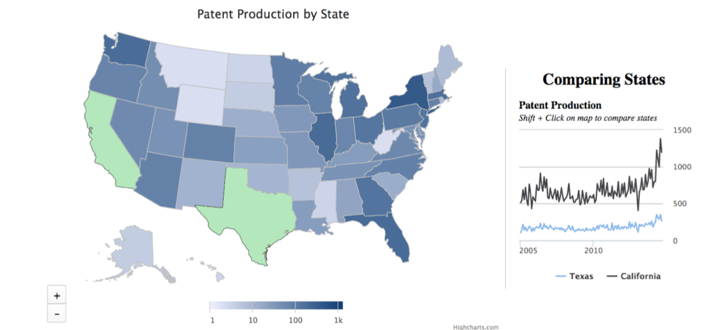

Patently Innovative
======================================

## Finding where innovation lives!
[www.patentlyinnovative.net](http://www.patentlyinnovative.net)

Patently Innovative is a tool to track innovation in different regions 
by collecting, cleaning, and aggregating patent information from the 
United States Patent and Trademark Office (USPTO) using technologies from the
 Hadoop ecosystem.

# What Patently Innovative Does
Patently Innovative allows users to easily check and compare the patent 
production trends of various states.  The user interface, built with
Highmaps, allows the user to click on as many states as desired and
see the trends for patent production.  Patent production can be viewed 
as a raw total or per capita.  For example, you can easily compare the 
patent trends between California and Texas.

# How Patently Innovative Works
Patently Innovative uses a technology stack consisting of Beautiful Soup web-scraping, 
Bash and Python
 scripts, Hadoop Streaming, JSON Serialization with Hive, HBase, Flask, and Highcharts Java Script.

## Data Ingestion
Patently Innovative works by pulling public data from the United States Patent and Trademark Office (USPTO) 
and statistics from the Census Bureau, placing the files on the name node 
of a Amazon Web Services (AWS) cluster of Elastic Compute Cloud(EC2).  Specifically, a collection of Bash and Python 
scripts use Beautiful Soup to scrape the USPTO website to find the links to 
the relevant zip files.  The patent office releases new data weekly, which are
downloaded and updated with cron jobs.
  
The full fidelity zip files are immediately stored on the Hadoop Distributed File
 System (HDFS) for safe keeping via redundancy.  Some of the data is in simple 
Tab Separated Values (TSV) files, but the most recent patent information is
stored in highly nested XML files.  Semi-structured data like XML allows flexibile 
formatting, but can be tricky to parse on distributed systems, pulling out only
 the relevant information rather than the various tags (see sample below).

 
Unfortunately, the USPTO lists each patent on several different lines, which vary
greatly from patent to patent depending on the number of authors, organizations, etc.  This is imcompatible with most
 technologies to in the Hadoop ecosystem, which typically require a single record 
on a single line.  For this reason, the XML files are cleaned and parsed using 
Bash and Python scripts before further processing within the Hadoop ecosystem.
  
To circumvent this bottleneck, I have wrote a meta-programming script that splits this workload 
onto the worker nodes.  This is accomplished by finding the ip addresses of the 
worker nodes using the *dfsadmin* command, then the *scp* and *ssh* commands to distribute and run the 
relevant scripts.  This work around achieves scalability, but lacks the true fault
 tolerance of the Hadoop ecosystem.  

After this staging, the patents are converted into single-line JSON records for further cleaning with Hive.  
JSON still has the flexibility of semi-structured data, but without the added size 
from the closing tags of XML.  An example of the JSON data, with some of the 
relevant information highlighted, is shown below with pretty-print formatting.

After processing and staging on the Linux File System of the nodes, the JSON 
records are placed on the HDFS, partitioned by the year of the patent.  The files 
are then loaded into Hive tables using the open source serialization/deserialization (SerDe) 
tools developed by [Roberto Congiu](https://github.com/rcongiu/Hive-JSON-Serde).  
This SerDe is perfect for my data, which is highly nested and has a very dynamic schema over the various 
years.  Unlike some of the native Hive tools, this SerDe allows me to ignore the 
superfluous information, and just extract what's needed.  More so, by taking full 
advantage of Hive, nearly two decades of data (around 50GB) can be calculated in a batch process of only 20 minutes...very cool!  After this, the
data is in the nice tabular form.

After this the data is aggregated over different time periods and placed into HBase in a highly denormalized form, facilitating
 real-time queries.  For the front-end, I used the Thrift protocol with the Python Flask 
 library to setup a RESTful API.  For a nice visual user interface (UI), I modified 
the Java Script templates from Highmaps.  The whole pipeline is shown below.

 

